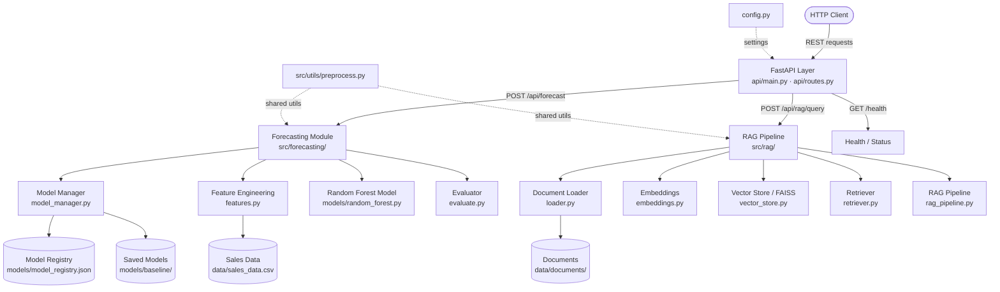

# AI Supply Chain Backend

## Project Overview

An intelligent supply chain management backend that combines **machine learning forecasting** with a **Retrieval-Augmented Generation (RAG) pipeline** to deliver demand predictions and natural-language insights. Built with FastAPI, the system exposes a clean REST API that integrates a Random Forest forecasting model (with a pluggable model registry) and a semantic document retrieval pipeline powered by FAISS vector search and sentence-transformers.

---

## Features

| Category | Capability |
|---|---|
| **Sales Forecasting** | Multi-period demand forecasting via a trained Random Forest model |
| **Model Registry** | Save, load, and version ML models using `joblib` + a JSON registry |
| **RAG Pipeline** | Semantic search over supply chain documents using FAISS + sentence-transformers |
| **Batch Queries** | Submit multiple RAG queries in a single API call |
| **REST API** | FastAPI with automatic OpenAPI (Swagger) and ReDoc documentation |
| **Modular Architecture** | Clean separation between API layer, ML core, RAG core, and utilities |
| **Data Preprocessing** | Shared preprocessing utilities for consistent feature engineering |
| **Async-ready** | Fully async endpoint handlers for high concurrency |

---

## Architecture



---

## Project Structure

```
ai-supply-chain-backend-2-/
├── backend/
│   ├── api/
│   │   ├── __init__.py          # Router exports
│   │   ├── main.py              # FastAPI app + startup logic
│   │   └── routes.py            # API endpoint definitions
│   ├── src/
│   │   ├── forecasting/
│   │   │   ├── model.py         # Base model interface
│   │   │   ├── model_manager.py # Save / load / version models
│   │   │   ├── features.py      # Feature engineering
│   │   │   ├── evaluate.py      # Model evaluation metrics
│   │   │   └── models/
│   │   │       └── random_forest.py
│   │   ├── rag/
│   │   │   ├── loader.py        # Document ingestion
│   │   │   ├── embeddings.py    # Sentence-transformer embeddings
│   │   │   ├── vector_store.py  # FAISS index management
│   │   │   ├── retriever.py     # Semantic retrieval
│   │   │   └── rag_pipeline.py  # End-to-end RAG orchestration
│   │   └── utils/
│   │       └── preprocess.py    # Shared preprocessing helpers
│   ├── data/
│   │   ├── sales_data.csv       # Historical sales data
│   │   └── documents/           # Text documents for RAG
│   ├── models/
│   │   ├── model_registry.json  # Model version registry
│   │   └── baseline/            # Persisted model files (.joblib)
│   ├── config.py                # App configuration / env vars
│   └── requirements.txt         # Python dependencies
├── tests/
│   ├── test_api.py
│   └── test_pipeline.py
├── FASTAPI_SETUP_GUIDE.md
└── README.md
```

---

## Setup Instructions

### Prerequisites

- Python 3.9 or higher
- `pip` package manager
- (Optional) A virtual environment tool such as `venv` or `conda`

### 1. Clone the Repository

```bash
git clone <repository-url>
cd ai-supply-chain-backend-2-
```

### 2. Create and Activate a Virtual Environment

```bash
# Windows
python -m venv .venv
.venv\Scripts\activate

# macOS / Linux
python -m venv .venv
source .venv/bin/activate
```

### 3. Install Dependencies

```bash
pip install -r backend/requirements.txt
```

### 4. Configure Environment Variables

Create a `.env` file in the `backend/` directory (copy from `.env.example` if provided):

```bash
cp backend/.env.example backend/.env
```

Edit `backend/.env` with your settings (database URLs, API keys, etc.).

### 5. Run the Development Server

```bash
cd backend
python -m api.main
```

The API starts at **http://localhost:8000**

### 6. Explore the API Docs

| Interface | URL |
|---|---|
| Swagger UI | http://localhost:8000/docs |
| ReDoc | http://localhost:8000/redoc |
| Health check | http://localhost:8000/health |

---

## API Reference

| Method | Endpoint | Description |
|---|---|---|
| `GET` | `/health` | Health check |
| `GET` | `/api/status` | API status |
| `POST` | `/api/forecast` | Generate a demand forecast |
| `GET` | `/api/forecast/{id}` | Retrieve a forecast result by ID |
| `POST` | `/api/rag/query` | Query the RAG pipeline |
| `POST` | `/api/rag/batch-query` | Submit multiple RAG queries |

---

## Running Tests

```bash
pytest tests/
```

---

## Tech Stack

- **FastAPI** — async REST framework
- **scikit-learn** — Random Forest forecasting
- **FAISS** — vector similarity search
- **sentence-transformers** — document embeddings
- **joblib** — model serialization
- **pandas / numpy** — data processing
- **Pydantic v2** — request/response validation
